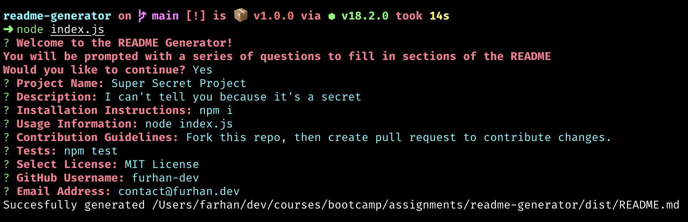

# README Generator

## Description
This NodeJs CLI tool generates a professional README file based on user input. The README contains a title, description, table of contents, installation instructions, usage guide, license badge and info, how to contribute section, tests, and a questions section.

## Table of Contents
* [Installation](#Installation)
* [Usage](#Usage)
* [Contribution](#Contribution)
* [Tests](#Tests)
* [License](#License)
* [Questions](#Questions)

## Installation
Make sure you have NodeJs installed before cloning this repo `brew install node` after cloning, `npm i` to install dependencies and then `node index.js` to run the CLI tool

## Usage
Follow the prompts on the command line and input information you would like displayed in the README

## Contribution
Please fork this repo and create a pull request if you would like to contribute changes

## Tests
No unit tests exist at the moment but in the future `npm test` will run all tests

## License
This project is covered under the MIT License

## Questions
* Email: [contact@furhan.dev](contact@furhan.dev)
* GitHub: [furhan-dev](https://github.com/furhan-dev)
* Video Walkthrough: [Screencastify link](https://drive.google.com/file/d/1pre4oDRt-Sgp9TgNXaUwqGl6AzN5wBds/view)
